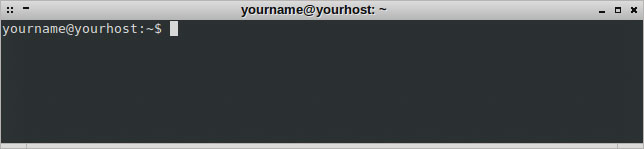
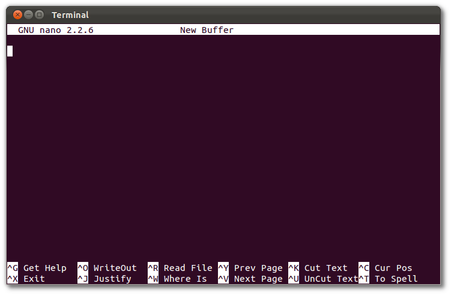
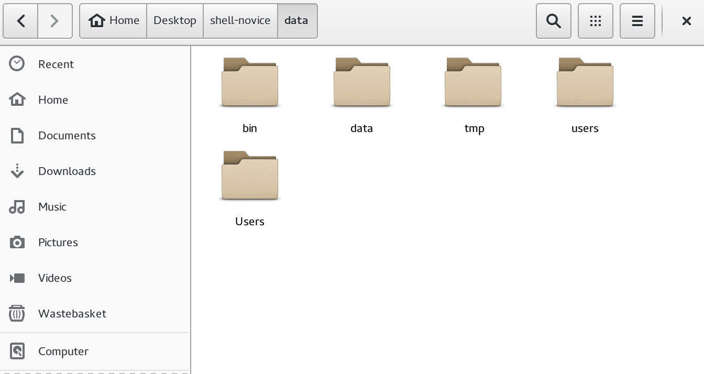
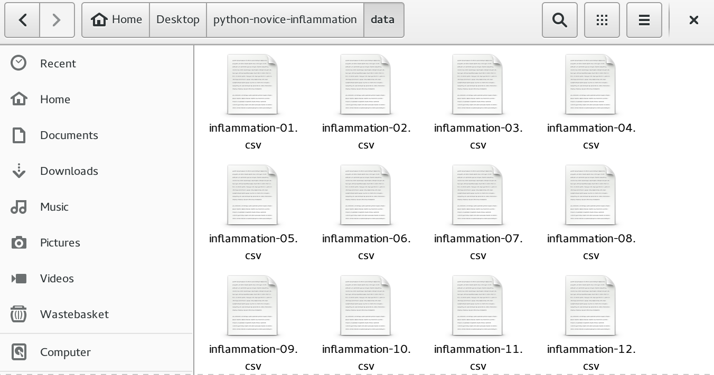

## Unix-Shell

#### 1. Be sure you have the shell
 - Linux/Mac: You are done!
 - Windows: Download and install [git for windows](https://git-for-windows.github.io/). 
  **Important:**
  Windows users, on the 6th page of the installation wizard (the
  page titled  `Configuring the terminal emulator...`) select `Use Windows'
  default console window`.

#### 2. You have got nano on your machine
 - Linux/Mac: You should be done!
 - Windows: Download and install [SoftwareCarpentry Windows tools]({{site.swc_installer}})

Check if it's there by opening a terminal and writing the following:

~~~
$ nano 
~~~

The terminal should show a screen with a bar on top saying `GNU nano` and with a
menu in the bottom.

Press `Ctrl + x` to exit.

##### Would you like to use other text editor?
 - Linux and Mac could install any text editor easily and they will - mostly - be
 available on the terminal.
 Some easy-to-use text editors are: [Gedit](https://wiki.gnome.org/Apps/Gedit),
 and [Kate](http://kate-editor.org/) for Linux and
 [Text Wrangler](http://www.barebones.com/products/textwrangler/) for Mac.
 Some of these are normally installed by default.

 - Windows does not come with a good text editor, but you could install
 [Notepad++](http://notepad-plus-plus.org/).

 - New modern text editors as [Sublime Text](http://www.sublimetext.com/) and
 [atom](https://atom.io/) are available for all the operative systems.

Note: In Linux you probably won't need to add them to your `$PATH` so you could
just do `gedit` from the terminal and the program will open.
However, in Mac and Windows may not be as easy.
Check how to use [TextWrangler](http://apple.stackexchange.com/a/9588) from the terminal
if you are using Mac
or [Sublime](https://danlimerick.wordpress.com/2014/01/07/git-for-windows-tip-opening-sublime-text-from-bash/) in Windows

#### 3. Download the data needed for the workshop

You need to download some files to follow this lesson:

 - Make a new folder in your Desktop called shell-novice.
 - Download [shell-novice-data.zip](shell-novice-data.zip) and move the file to this folder. 
    If it’s not unzipped yet, double-click on it to unzip it. You should end up with a new folder called data.

Your new directory should show the following folders:

You can access this folder from the Unix shell with:
    
~~~
$ cd && cd Desktop/shell-novice/data
~~~

## Git

#### 1. Git in your machine

- Windows: If you have followed the steps above you are done.
- Mac:
  - For OS X 10.9 and higher, download and install the most recent *mavericks* installer
  from [Git for Mac](http://sourceforge.net/projects/git-osx-installer/files/)
  - For older versions of OS X (10.5-10.8) use the above link but search for *snow-leopard*.
- Linux: Use your distro's package manager to install it.

Check that it works by opening a **new** terminal window and execute:

~~~
$ git --version
~~~

If you get something like:

~~~
git version 2.x.x
~~~

You are done, if you get something like

~~~
bash: git: command not found
~~~

Then the installation has not work properly

#### 2. GitHub

Create an account on [github](https://github.com/join) and make sure you remember
your username and password.

## Python

#### 1. Python in your machine
1. Download and install [Anaconda](http://docs.continuum.io/anaconda/install) for
Python 2.7 following the instructions shown.

2. Check the installation [running the scripts for this bootcamp](python_check.html)

#### 2. Download the data needed for the workshop

You need to download some files to follow this lesson:

 - Make a new folder in your Desktop called python-novice-inflammation.
 - Download [python-novice-inflammation-data.zip](python-novice-inflammation-data.zip) and move the file to this folder. 
   If it’s not unzipped yet, double-click on it to unzip it. You should end up with a new folder called data.

Your new directory should show the following folders:

You can access this folder from the Unix shell with:

~~~
$ cd && cd Desktop/python-novice-inflammation/data
~~~

